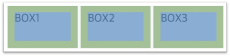
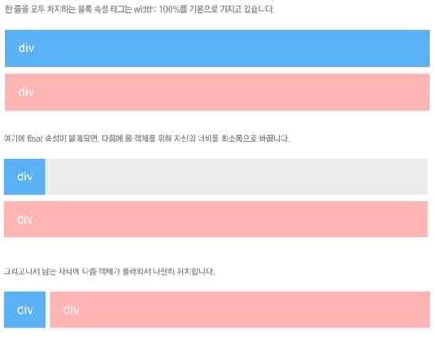
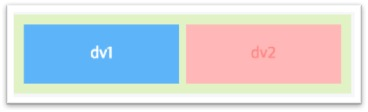

#POSITIONING

페이지의 레이아웃을 결정할 때 기본이 되는 부분들에 대해서 정리한다.

## 1. display – block vs inline

### inline

줄을 바꾸지 않고 다른 요소와 함께 한 행에 위치하려 한다.<br>
Inline은 `width`, `height`, `margin` 속성을 적용할 수 없다.<br>
Inline 속성은 주로 문장 안에 사용하는 tag에서 default값으로 지정되어있다.<br>
ex) `<a>` `<span>` `<strong>` 등 _(특히 `<a>` 주의)_

> Tip) inline 속성의 높이를 지정해주려면 line-height 속성을 사용한다

### block

그 자체로 한 줄을 완전히 차지한다.<br>
기본적으로 `width: 100%` 속성을 갖고 있다.

### inline-block

inline과 같이 한 줄에 표현하면서도 `width`, `height`, `margin` 속성이 적용되도록 한다.

>**inline은 block보다 작은 개념!**<br>
Inline 속성 안에 block 속성을 넣으면 문법 오류<br>
`<a><p> ~~~ </p></a>` 같이 사용할 수 X

**inline-block 의 공백 문제**<br>
inline 혹은 inline-block을 사용하여 레이아웃 디자인을 할 때,<br>
박스가 끝나는 지점에 이상한 공백이 생기는 문제가 흔히 생긴다.

```html
<div class="box">BOX1</div>
<div class="box">BOX2</div>
<div class="box">BOX3</div>
```
다음과 같은 코드에 대해서



margin도 없는데 `div` 간의 여백이 생겼다?<br>
why? HTML 코드에서 `div` 사이의 띄어쓰기가 공백으로 함께 처리된 것!!


**해결방법**

1. HTML 코드 자체에서 띄어쓰기를 없앤다.. 어렵겠지ㅋㅋ
2. 부모 element에 `font-size: 0`을 부여하여 공백을 안 보이게 한다.


> Tip) 공백 문제로 레이아웃을 짤 때 inline-block보다는 block의 float 속성을 사용하는 것을 권장!<br>( 쓰게 된다면 `font-size: 0`을 부여! )


## 2. float 속성

객체를 좌측, 우측에 정렬하기 위한 기본적인 방법

>float을 선언하면 다음에 올 객체를 위해 자신의 너비를 최소폭으로 바꾼다!<br>
float 속성이 없는 객체가 나머지 공간을 모두 차지한다.



### float을 사용했을 때 발생하는 문제 (1)


이미지가 float이고 product_detail이 float 속성이 없다.<br>
이때 크기가 넘쳐나면 이미지 아래로 침범되는 문제가 발생

**해결방법**

1. product_detail에 `padding-left`값을 부여하여 간격을 확보하거나,
2. `float` 속성을 또 주고 `width` 값을 화면에 맞게 부여하거나,
3. **`overflow: hidden` 속성을 부여한다.**

> `overflow: hidden`은 내용물이 객체보다 클 경우 넘치게 되는 부분을 안보이게 하는 역할을 하는데 여기서는 다른 역할로 쓰인 것.

### float을 사용했을 때 발생하는 문제 (2)



float인 두 `div`를 포장하는 객체.. 우리가 원하던 모습은 이러하지만..


결과적으로는 이런 디자인이 나오는 경우!

포장용 객체는 자기가 품고 있는 객체가 float 속성을 갖는 경우 이를 포함하는 높이를 갖지 못한다!

**해결방법**

1. 포장용 객체에 `overflow: hidden` 을 부여한다. _(일반적)_
2. 포장용 객체에 float 속성을 부여한다. _(상황에 따라서!)_
3. 포장용 객체에 `display: inline-block` 을 부여한다. _(상황에따라 + 공백주의!)_
4. :after를 이용하여 포장용 객체 안에 `clear: both` 속성을 갖는 보이지 않는 객체를 넣는다.<br>_(overflow 쓸 때 가려지지 말아야 하는게 가려지는 경우!)_

### clear 속성

clear는 float 속성을 해제한다.
float 다음으로 나오는 element가 float의 영향을 받지 않도록 한다.


## 3. position 속성

### static
position 속성을 선언하지 않은 기본 값

### relative
`static`일 때의 위치에 상대적으로 위치를 결정

> Tip) `relative` 객체가 이동을 할 때 자신의 분신을 놓고 이동한다고 생각하자


Float으로 정렬된 두 객체.. `dv1`에 `relative`를 부여하여 이동을 하여 빈공간이 생겼으나 `dv2`는 그 공간을 메꾸지 않는다. (분신이 존재한다!)

> Tip) float을 통해 정렬한 객체는 `position: relative`를 이용하여 세밀한 조정을 하는 것이 일반적이다

### absolute
`relative`로 선언된 상위 요소를 기준으로 위치를 결정

> Tip) `absolute`의 상위요소는 `relative`여야 한다!

그렇기에 `absolute`는 구조를 잡을 때는 잘 쓰지 않고 `relative` 속성을 갖는 객체 내부에서 디테일한 위치를 조정할 때 사용한다.


바깥 `div`를 `relative`로 잡고 삭제 버튼과 더보기 버튼을 `absolute`로 위치지정

### fixed
브라우저 윈도우를 기준으로 위치를 결정 

> 스크롤이 생겨도 고정되는 element들은 `position: fixed`를 사용한다.


<br><br><br>
######참고사이트

- <http://www.beautifulcss.com/archives/1263>
- <http://www.beautifulcss.com/archives/787>