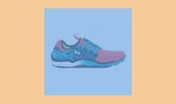
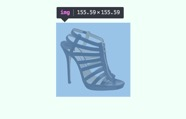
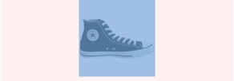
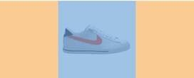
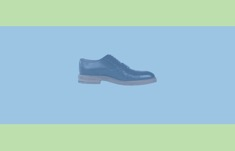
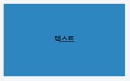
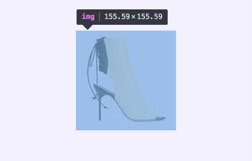

#CENTERING

좌우 정렬은 float을 이용하여 쉽게 구현이 되지만 가운데 정렬은 상황에 따라 다른 기법들을 적용해야 한다.<br>
보여지는 모든 예시들은 container와 block element로 구성된다.<br>

## 1. 공통적으로 적용되는 중앙정렬

### 1.1 box model 계산 ★★★

계산을 통해 마진 혹은 패딩을 설정하여 가운데 정렬 가능 --> 가장 기본


```scss
#container {
	width: 50px;
	padding: 50px 100px;
}

#block {
	width: 50px;
	height: 50px;
}
```

### 1.2 absolute에 대한 margin auto ★

block에 `absolute`를 부여하고 top, bottom / left, right에 0을 주어 `margin: auto`를 실행한다.



```scss
#container { 
	position: relative;
	width: 250px;
	height: 150px;
}

#block {
	position: absolute;
	top: 0; bottom: 0;
	left: 0; right: 0;
	margin: auto;
	width: 50px;
	height: 50px;
}
```

### 1.3 absolute에 대한 transform 이동

block에 absolute를 부여하고 top / left를 container에 대해 50% 이동을 한 후, block 사이즈의 50% 만큼 반대방향으로 이동시킨다.

이동시키는 방법으로는 `transform`을 이용한 방법 또는 `margin` 이용한 방법 등등으로 가능하다!



```scss
#container {
	position: relative;
	width: 250px;
	height: 150px;
}

// transform을 이용한 이동
#block {
	position: absolute;
	top: 50%;
	left: 50%;
	transform: translate(-50%, -50%);
	width: 50px;
	height: 50px;
}

// margin 계산을 이용한 이동
#block {
	position: absolute;
	top: 50%;
	left: 50%;
	margin: -25px 0 0 -25px;
	width: 50px;
	height: 50px;
}
```


## 2. 가로 가운데 정렬

### 2.1 text-align 이용 ★★★



```scss
#container {
	width: 250px;
	height: 150px;
	text-align: center;
}

#block {
	display: inline-block;
	width: 50px;
	height: 50px;
}
```

block에 inline 속성을 부여하여 `text-align: center` 가 먹히게 한다.<br>
하지만 inline 속성은 공백 문제를 처리해줘야 하므로 가능한 텍스트, 이미지 위주로 사용하자!

### 2.2 margin auto 이용 ★★★



```scss
#container {
	width: 250px;
	height: 150px;
}

#block {
	margin: 0 auto;
	width: 50px;
	height: 50px;
}
```

`margin-left`, `margin-right`이 `auto`로 설정되면 margin을 자동으로 같게 맞춰주므로 block은 화면 중앙에 위치하게 된다.

이 때, `margin: 0 auto`가 먹히려면 div는 `display: block` 속성을 가져야한다.


## 3. 세로 가운데 정렬

### 3.1 table-cell 이용 ★★



```scss
#extra {
	display: table;
}

#container {
	display: table-cell;
	vertical-align: middle;
	width: 250px;
	height: 150px;
}

#block {
	width: 50px;
	height: 50px;
}
```

`extra element`에 `table` 속성을 갖고 + `container`가 `table-cell` 속성을 갖고 `vertical-align: middle` 을 주면 세로정렬이 먹힌다.

`display: table`인 추가적인 `div`가 더 요구된다.<br>exterior element에 `display: table`을 부여하거나 없다면 새로운 exterior element를 만들어야 함

### 3.2 line-height 이용 ★★★



```scss
#container {
	width: 250px;
	height: 150px;
	line-height: 150px;
	text-align: center;
}
```

**single line inline element**에서 중앙정렬이 필요할 때! (이미지, 텍스트)<br>
단순히 `line-height`을 `height` 만큼 주면 가운데 정렬이 가능하다.

### 3.3 fake inline-block 이용


```scss
#container {
	width: 250px;
	height: 150px;
	text-align: center;
}

#block {
	display: inline-block;
	width: 50px;
	height: 50px;
	vertical-align: middle;
}

span {
	display: inline-block;
	width: 0;
	height: 100%;
	vertical-align: middle;
}
```

`block` 바로 다음에 fake inline-block tag를 새로 추가하여 `width: 0`, `height: 100%`를 주고 `vertical-align: middle` 속성을 부여한다.

이 때 container 안의 모든 element도 `inline-block` tag를 갖고 `vertical-align: middle` 속성을 가져야 한다!

하지만 inline의 공백 문제가 있으니 사용 자제

### 3.4 display flex 이용



```scss
#container {
	display: flex;
	justify-content: center;
	align-items: center;
	width: 250px;
	height: 150px;
}

#block {
	width: 50px;
	height: 50px;
}
```

`display: flex`를 사용하면 간결하게 중앙정렬을 사용할 수 있다.<br>
하지만 ie 10 이상의 브라우저에서 지원이 되어 구버전 브라우저에서는 `display: box`를 함께 사용해야 한다. 그 코드는 검색 고고!

<br><br><br>
######참고 사이트
- <http://bit.ly/2a3QXt8>
