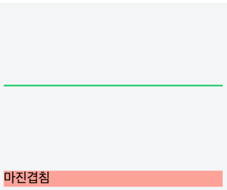

#BOX MODEL

Positioning을 통해 레이아웃을 구성하는 법을 봤다면 이번에는 하나의 element를 구성하는 box model에 대해 알아보자!

## 1. Box Model


* margin - 외부 여백
* border - 경계선
* padding - 내부 여백
* content - 컨텐츠

## 2. Box Size

### Width and Height of Element
CSS에서 지정하는 element의 width와 height는 box model에서 content에 한정된다.

### box-sizing


box-sizing을 border-box로 지정하면 element의 padding과 border가 더는 box model의 너비를 늘리지 않는다. 지금은 content-box가 표준!

## 3. 마진 겹침

마진 겹침 현상은 *세로 방향*의 element 사이에서 발생한다.

### 형제 element 간의 마진 겹침


수직관계에 있는 형제 element가 margin 값이 겹칠 때 둘 중 큰 margin 값이 두 element 사이의 간격이 된다.

### 부모/자식 element 간의 마진 겹침


부모 element가 시각적인 속성을 가지고 있지 않으면 자식 element와 마진이 겹치게 된다.


부모 element에 border 값과 같은 시각적 속성을 주면 마진 겹침이 풀리게 된다.


> 주의! 여기서 border, padding은 시각적 요소가 되어 마진 겹침을 풀지만 width, height는 마진 겹침을 풀지 못함을 알 수 있다.

### 자기 자신 안에서의 마진 겹침

element가 시각적 요소를 갖지 않으면 상/하 마진은 겹치게 된다.

```scss
.element {
	margin: 100px 0;
}
```


```scss
.element {
	margin: 100px 0;
	border: 1px solid #2ecc71
}
```



> 노트! 여기서는 border, padding 뿐 아니라 height 또한 마진 겹침을 푸는 시각적 요소가 될 수 있다.