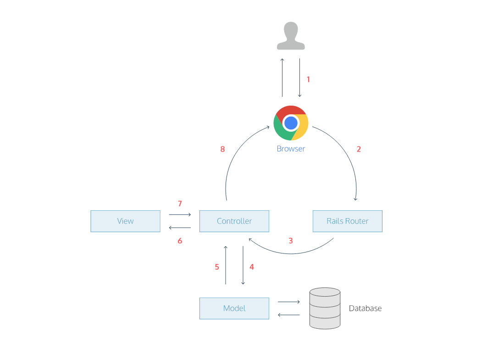

# [Controller] Basic

## 1. Controller의 역할

### Request/Response Cycle
클라이언트가 url 요청을 보냈을 때 발생하는 flow



1. When a user types URL, the browser makes a request for that URL
2. The request hits the Rails router (`config/routes.rb`)
3. The router maps the URL to the correct controller and action to handle the request
4. The action receives the request, and asks the model to fetch data from the database
5. The model returns a list of data to the controller action
6. The controller action passes the data on to the view
7. The view renders the page as HTML
8. The controller sends the HTML back to the browser

MVC에서 요청 처리와 관련된 기능을 수행하는 부분이 Controller이다.<br>
컨트롤러는 요청을 해석하고 모델을 호출해서 결과를 뷰로 출력하므로써 적절한 응답을 돌려준다.

컨트롤러의 역할을 크게 분류하면 **요청 정보 추출**과 **응답 생성**으로 나눌 수 있다.

## 2. Controller 생성
```bash
rails g controller <컨트롤러이름> <액션이름>
```

controller 파일에서 action(`public method`)가 실행되면 
```
app/views/ --> 컨트롤러이름 디렉토리 --> 액션이름 erb 파일
```
위 디렉토리의 erb 파일을 view template 으로 사용하여 응답으로 보낼 html 파일을 렌더링한다.

EX:
```
rails generate controller welcome index
```

welcome 컨트롤러와 index 액션의 생성
app/views/welcome/index.html.erb 파일이 렌더링됨

## 3. scaffold generator로 형성된 CRUD

scaffold generator는 제너레이터 종류 중 하나로,
scaffold generator를 이용하면 5번에서의 7가지 controller action이 형성된다.

데이터에 대한 액션은 크게 5가지로 나타난다.
(`new`와 `edit` 액션은 데이터를 수정하지 않고 단순히 view만 렌더링하는 작업임)

| 모델작업 | 액션 |
| ---
| **C**reate | create |
| **R**ead | index, show |
| **U**pdate | update |
| **D**elete | destroy |

### 3.1 create 액션
model의 한 객체를 생성하여 DB table에 저장

### 3.2 index 액션
DB 쿼리에서 model의 모든 객체를 호출하여 @posts 변수에 할당

### 3.3 show 액션
DB 쿼리에서 model의 특정 객체를 호출하여 @post 변수에 할당

### 3.4 update 액션
DB 쿼리에서 model의 속성을 변경한 후 DB table에 저장

### 3.5 destroy 액션
DB 쿼리에서 model의 특정 객체를 삭제

### 3.6 new 액션
새로운 데이터를 입력받을 form을 응답으로 보낸다.

### 3.7 edit 액션
기존 데이터를 수정하기 위한 form을 응답으로 보낸다.

## 4. Controller의 필터기능
Controller에는 필터기능을 사용할 수 있는데 특정 액션과 관련하여 private method를 선언한다.

* before_action
* after_action
* around_action

### 4.1 before_action
```
before_action :set_post, only: [:show, :edit, :update, :destroy]
```

controller 액션 중 show, edit, update, destroy가 샐행되기 전에 반드시 set_post method를 실행시키라는 필터

## 5. Controller의 strong parameter
model DB에 접근을 제한하기 위해 접근가능한 속성 `white list` 개념을 사용한다.
```
private
  def post_params
    params.require(:post).permit(:title, :content)
  end
```

파라미터로 넘겨받은 모델의 속성 중에 title과 content 만을 `white list`로 인정한다는 뜻이다.
title과 content를 제외하고 다른 속성은 save 및 update 되지 않다는 말!
(그러면 create, update 액션에서 사용되겠지!)
